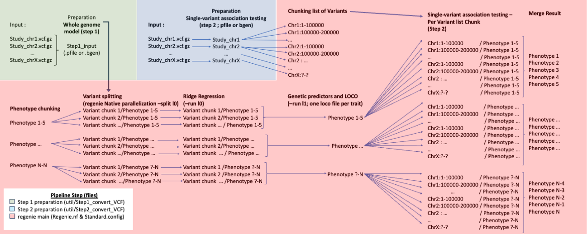

# Regenie Parallelisation Pipeline

## About

Pipeline to perform further parallelize regenie on Imputed/Exome/CNV/WGS data, to evaluate association with binary and continuous phenotype. Currently does not support burden testing or interaction tests (to be implemented). Regenie is a tool to perform genome wide association testing in a fast and memory efficient capacity, this pipeline further parallelise the process. 

This pipeline parallelise the regenie process in three level (as seen below) : 1) Phenotypes are processed in parallel over the whole pipline, 2) the whole genome modeling (step 1) is partly processed in parallel per variant, and 3) Variant assoiciation testing is parralelised by processing variants in multiple distributed distinct groups.
 
This implementation does not perform the following, which can be considered necessary, principal componant analysis (almost always used as covariates), ancestry subsetisation (as with most GWAS tool regenie does not perform well with multiple ancestry combined) and by default the variant used for association testing are unfiltered (such step should be performed in advance).

## Workflow

```diff
- Important!
@@ Phenotype file must be formated as mentionned in regenie Documentation see below for example @@
@@ By default Step 2 inputs (imputed/Exome/CNV files) are unfiltered, such step should be taken before this pipeline @@
@@ Commonly, depending on the naming structure within the VCF inputed in the step 2 file preparation the sample naming might differ from the phenotype/covariate file, consider using the '-double-id/--const-fid/--id-delim' plink2 option to @@
```




## Instalation 

### Software requiered
Input file preparation :

- git (installation)
- Plink* version >2 or qctools, bgenix and bcftools
- Nextflow*

Regenie main pipeline :

- git (installation)
- Plink* version >2
- Nextflow* (tested with version 21)
- Singularity* (tested with version 21)

\* If used in ComputeCanada environment can be loaded through command : module load [ Package name ]

### Installation

- Clone this repository
```
git clone https://github.com/CERC-Genomic-Medicine/Regenie_nextflow.git 
```
- pull regenie image
```
singularity pull docker://ghcr.io/rgcgithub/regenie/regenie:VERSION.gz    
tested with singularity pull docker://ghcr.io/rgcgithub/regenie/regenie:v3.0.1.gz  
```
## Execution

### Prepartion of LD-pruned set of variants for Whole genome modeling (regenie's first step)

1) At Minimum, change declaration of the following variables within the Step1_convert_VCF.config file : 

* `VCF_files` -- full path to your input files ( Genotyped-array files if possible )
* `lcr_regions` -- low complexity region bedfile, verify that the declaration uses the same genome buid (denotated by the option name)
* `ld_regions` -- long range high LD region, verify that the declaration uses the same genome buid (denotated by the option name)
* `plink2_exec` -- path to plink execuable or 'plink2' if already in your $PATH
or
* `qctool_exec` and  `bgenix_exec` -- Add path to respective execuable (qctools bgenix) or their name if already in your $PATH

```
@@ Important : Other variable are present but have a default value :
```

* `format` -- format of the output (valid options : PGEN / BGEN)
* `maf` -- Minimal allele frequency
* `geno` -- Maximum Missing genotype frequency per-variant
* `mind` -- Maximum Missing genotype frequency per-sample
* `HWE` -- Hardy-Weinberg Equilibrium threshold

```
@@ The following options are general and present in  all configuration files :
```

* `OutDir` -- Output directory
* `executor` -- clusters executor
* `clusterOptions` -- option to be added to the job submission (generally billing account)
* `cpus` -- number of cpu for each jobs
* `time` -- job time limit
* `memory` -- memory for each jobs


### (Imputed Only) Prepartion of variant files for Single-variant association testing (regenie's second step)

2) At Minimum, change declaration of the following variables within the Step2_convert_VCF.config file : 

* `VCF_files` -- full path to your input files ( Genotyped-array files if possible )
* `vcf_field` --  dosage type depending on the desired output format and availlability
* `plink2_exec` -- path to plink execuable or 'plink2' if already in your $PATH
or
* `qctool_exec`,  `bgenix_exec` and `bcftools_exec` -- path to respective execuable (qctools bgenix bcftools) or their name if already in your $PATH

```
@@ Important : Other variables are present but have a default value
```

* `format` -- format of the output (valid options : PGEN / BGEN)

### Execution of the regenie GWAS analyses

2) At Minimum, change declaration of the following variables within the Standard.config file (or Binairy.config if phenotypes are binary) : 

* `genotypes_file` -- Full path to the .pgen or .bgen files containing LD-pruned set of variants
* `gwas_genotypes_files` -- Full path to the .pgen or .bgen variant file for Single-variant association testing 
* `PheStep` -- Number of phenotype to be analysed in each jobs (i.e. total number of phenotype / PheStep = job parallelisation level)
* `njobs` -- Number of jobs over which part of the first step of regenie is distributed
* `SnpStep` --  number of SNPs to be examined in each jobs instances of regenies second step (i.e. total number of SNPs / SnpStep = nb jobs @ second step)
* `pheno_file` -- phenotype file tab or spaces delimited (see below)
* `covar_file` -- covariate file tab delimited (see below)
* `CatCovar` -- Comma separated Categorical Variables
* `container` -- Path to image of regenie

phenotype or covariate file structure

```
FID IID Pheno1/Covar1 Pheno2/Covar2  
F1   S1      0.4            0.75
F2   S2      0.2             0.5
...
```

```
@@ Important : the pipeline is paralized per phenotype group (see PheStep) throughout, therefore the total number of job for regenie's step 1 and 2 are multiplied.
@@ Important : Other variables are present but have a default value
```

* `Threads_S_10` -- number of threads to be declared to regenie for the creation files necessary for of the parallelisation of the first step
* `Threads_S_11` -- number of threads to be declared to regenie in the Ridge regression part of the first step
* `Threads_S_12` -- number of threads to be declared to regenie in the Cross-validation part of the first step
* `Threads_S_2` -- number of threads to be declared to regenie in the second step
* `Bsize` -- Numnber of variants to be kept in memoy (i.e. block)
* `Binairy` -- If using binairy phenotype additional modidfication of default argument (maxstep-null and/or maxiter-null) may be requiered to achieve convergence 

## Additional Scripts 
- util/Scripts/random_gen.py (Generate random covariate or phenotype)
- Manhattan.py (provide cursory manhattan plot)
* needs python packages: pandas, bioinfokit, matplotlib, argparse and random
