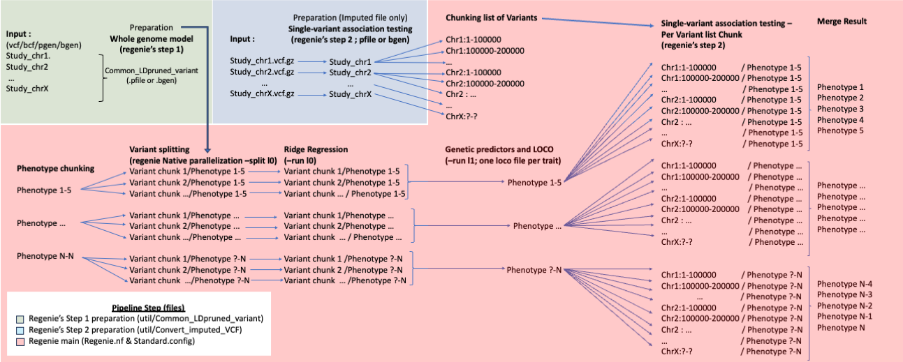

# Regenie Parallelization Pipeline

## About

Pipeline to perform further parallelize [regenie](https://rgcgithub.github.io/regenie/) (Mbatchou, J., Barnard, L., Backman, J. _et al._ ) on Imputed/Exome/CNV/WGS data, to evaluate genome association with binary and continuous phenotype. Currently support burden testing (experimentally) but not interaction tests (to be implemented). Regenie is a tool to perform genome-wide association testing in a fast and memory efficient capacity, this pipeline further parallelizes the process.

This pipeline parallelizes the regenie process in three levels (as seen below) : 1) Phenotypes are processed in parallel over the whole pipeline, 2) the whole genome modelling (step 1) is partly processed in parallel per variant, and 3) Variant association testing is paralleled by processing variants in multiple distributed distinct groups.
 
This implementation does not perform the following, which can be considered necessary, principal component analysis (almost always used as covariates), ancestry selection (as with most GWAS tool regenie does not perform well with multiple ancestry combined) and by default the variants used for association testing are unfiltered (such step should be performed in advance).

## Caveat about X chromosome

By default, BGEN stores non-par region of the X chromosome in a haploid format, while this storage is correct, Regenie's underlying model uses a homozygote diploid format for these regions. To remedie this, we recommend working with PGEN, which by default convert those regions to the expected format.

## Caveat about Phenotype selection

```diff
- Important!
Regenie imputes missing values for quantitative phenotypes, so it's crucial to ensure that the percentage of missing phenotypes remains low and consistent.  
According to the Regenie paper, the maximum tested threshold for missing phenotypes is 15%.  
A script is provided at util/Scrips/Phenotype_missingness_analysis.py to assess the missingness compatibility of phenotypes and group them into compatible* clusters.  
*(within defined threshold)
```

## Workflow

```diff
- Important!
@@ Phenotype file must be formatted as mentioned in regenie Documentation see below for example @@
@@ By default Step 2 inputs (imputed/Exome/CNV files) are unfiltered, such step should be taken before this pipeline @@
@@ Commonly, depending on the naming structure within VCF, the sample naming might differ from the phenotype/covariate file, consider using the '-double-id/--const-fid/--id-delim' plink2 options @@
@@ When working with imputed data Regenies's Step 1 preparation is performed with genotype-array data while Step 2 is imputed data @@
```


## Installation 

### Software required
Input file preparation :

- git (installation)
- Plink* version >2 or qctools, bgenix and bcftools
- Nextflow*

Regenie main pipeline :

- git (installation)
- Plink* version >2
- Nextflow* (tested with version 21)
- Singularity* (tested with version 21)

\* If used in ComputeCanada environment can be loaded through command : module load [ Package name ]

### Install

- Clone this repository
```
git clone https://github.com/CERC-Genomic-Medicine/Regenie_nextflow.git 
```
- pull regenie image
```
singularity pull docker://ghcr.io/rgcgithub/regenie/regenie:VERSION.gz    
tested with singularity pull docker://ghcr.io/rgcgithub/regenie/regenie:v3.0.1.gz  
```
## Execution

### Preparation of LD-pruned set of variants for Whole genome modelling (regenie's first step)


1) At Minimum, change declaration of the following variables within the Common_LDpruned_variant.config file : 

* `VCF_files` -- full path to your input files (Genotyped-array files if working with imputed data, called WGS file appropriate )
* `lcr_regions` -- low complexity region bed file, verify that the declaration uses the same genome build (denoted by the option name)
* `ld_regions` -- long-range high LD region, verify that the declaration uses the same genome build (denoted by the option name)
* `plink2_exec` -- path to plink executable or 'plink2' if already in your $PATH
or
* `qctool_exec` and  `bgenix_exec` -- Add path to respective executable (qctools bgenix) or their name if already in your $PATH

```
@@ Important : Other variables are present but have a default value see below
@@ Important : If WGS, Rsq should be lower (more stringent) to result in below 1 million SNP
```

* `format` -- format of the output (valid options : PGEN / BGEN)
* `maf` -- Minimal allele frequency
* `geno` -- Maximum Missing genotype frequency per-variant
* `mind` -- Maximum Missing genotype frequency per-sample
* `HWE` -- Hardy-Weinberg Equilibrium threshold
* `Rsq` -- Independance clumping threshold (for WGS a lower value (more stringent) should be considered (ex. 0.3))

```
@@ The following options are general and present in  all configuration files :
```

* `OutDir` -- Output directory
* `executor` -- clusters executor
* `clusterOptions` -- option to be added to the job submission (generally billing account)
* `cpus` -- number of CPU for each job
* `time` -- job time limit
* `memory` -- memory for each job


### (Imputed Only) Preparation of variant files for Single-variant association testing (regenie's second step)

2) At Minimum, change declaration of the following variables within the Convert_imputed_VCF.config file : 

* `VCF_files` -- full path to your input files ( Genotyped-array files if possible )
* `vcf_field` --  dosage type depending on the desired output format and availability
* `plink2_exec` -- path to plink executable or 'plink2' if already in your $PATH
or
* `qctool_exec`,  `bgenix_exec` and `bcftools_exec` -- path to respective executable (qctools bgenix bcftools) or their name if already in your $PATH

```
@@ Important : Other variables are present but have a default value
```

* `format` -- format of the output (valid options : PGEN / BGEN)

### Execution of the regenie GWAS analyses

3) At Minimum, change declaration of the following variables within the Regenie_main_[continuous/binary].config file : 

```
@@ Important : If WGS, WGS file should be directly inputed in the gwas_genotypes_files. 
```


* `genotypes_file` -- Full path to the .pgen or .bgen files containing LD-pruned set of variants
* `gwas_genotypes_files` -- Full path to the .pgen or .bgen variant file for Single-variant association testing  ** Pattern filename [unique]_\* **
* `PheStep` -- Number of phenotype to be analyzed in each job (i.e. total number of phenotypes / PheStep = job parallelization level)
* `njobs` -- Number of jobs over which part of the first step of regenie is distributed
* `SnpStep` --  number of SNPs to be examined in each job instances of regenies second step (i.e. total number of SNPs / SnpStep = nb jobs @ second step)
* `pheno_file` -- phenotype file tab or spaces delimited (see below) ** Phenotypes names cannot containt '.' **
* `covar_file` -- covariate file tab delimited (see below)
* `CatCovar` -- Comma separated Categorical Variables
* `container` -- Path to image of regenie

phenotype or covariate file structure :

```
FID IID Pheno1/Covar1 Pheno2/Covar2  
F1   S1      0.4            0.75
F2   S2      0.2             0.5
...
```

```
@@ Important : the pipeline is parallelized per phenotype group (see PheStep) throughout, therefore the total number of job for regenie's step 1 and 2 are multiplied.
@@ Important : Other variables are present but have a default value
```

* `Threads_S_10` -- number of threads to be declared to regenie for the creation files necessary for of the parallelization of the first step
* `Threads_S_11` -- number of threads to be declared to regenie in the Ridge regression part of the first step
* `Threads_S_12` -- number of threads to be declared to regenie in the Cross-validation part of the first step
* `Threads_S_2` -- number of threads to be declared to regenie in the second step
* `Bsize` -- Number of variants to be kept in memory (i.e. block)
* `Binairy` -- If using binary phenotype additional modification of default argument (maxstep-null and/or maxiter-null) may be required to achieve convergence 

## Additional Scripts 
- util/Scripts/random_gen.py (generate random covariate or phenotype)
- util/Manhattan_Miami.py (provide Manhattan and/or Miami plot)
* needs python packages: pandas, matplotlib, argparse and random
- util/Scrips/Phenotype_missingness_analysis.py (provides an analysis of the missingness compatibility between QT-phenotypes)
